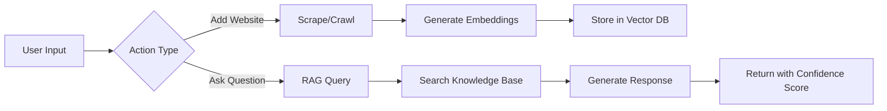
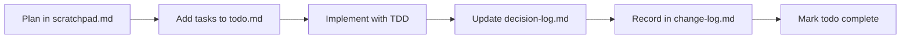

# AI RAG Agent

An intelligent knowledge assistant that automatically ingests website content and provides instant, contextual answers to user questions with confidence scoring and source attribution.

## 🏗️ How It Works

This RAG (Retrieval-Augmented Generation) application ingests website content and provides intelligent, context-aware answers with confidence scoring.

### Core Workflow



### 1️⃣ Adding Content to Knowledge Base

When you add a website URL, the system:

1. **Determines Strategy** - Single page → ScrapeTool, Multiple pages → CrawlTool
2. **Fetches Content** - Tries fast fetch first, falls back to Playwright for JavaScript sites
3. **Processes Content** - Cleans HTML, extracts text, chunks if >3000 characters
4. **Generates Embeddings** - Creates 1536-dimensional vectors using OpenAI
5. **Stores Vectors** - Saves in VectorStore with metadata for retrieval

### 2️⃣ Answering Questions (RAG Process)

When you ask a question, the system:

1. **Embeds Query** - Converts your question to a vector
2. **Searches Knowledge** - Finds similar content using cosine similarity
3. **Calculates Confidence** - Scores relevance (0.0 to 1.0)
4. **Decides Mode**:
   - Confidence ≥ 0.5 → RAG mode (uses knowledge base)
   - Confidence < 0.5 → Direct mode (GPT-5 only)
5. **Generates Answer** - Augments prompt with context and calls GPT-5
6. **Returns Response** - Includes answer, confidence score, and sources

### 🔧 Technical Architecture

```
┌─────────────────┐     ┌──────────────────┐     ┌─────────────────┐
│   Frontend UI   │────▶│   API Routes     │────▶│   Tool Layer    │
│  (React/Next)   │     │  /api/chat       │     │  ScrapeTool     │
│                 │     │  /api/scrape     │     │  CrawlTool      │
└─────────────────┘     │  /api/crawl      │     └─────────────────┘
                        └──────────────────┘              │
                                 │                        ▼
                                 ▼                ┌─────────────────┐
                        ┌──────────────────┐     │   Web Content   │
                        │   RAG Service    │────▶│  Fetch/Browser  │
                        │  - Embeddings    │     └─────────────────┘
                        │  - Vector Search │
                        │  - GPT-5 Chat    │
                        └──────────────────┘
```

### 🎯 Key Features in Action

- **Smart Scraping**: Automatically switches between fetch (fast) and Playwright (JavaScript)
- **Respectful Crawling**: Honors robots.txt, implements rate limiting
- **Intelligent Chunking**: Splits large documents for optimal embedding
- **Confidence Scoring**: Shows how certain the AI is about its answer
- **Source Attribution**: Links every answer back to its source material
- **5-Minute Cache**: Avoids redundant scraping of same content

### 📊 Example Flow

**Adding a website:**
```
1. User enters: https://docs.example.com
2. System crawls 10 pages (respecting robots.txt)
3. Extracts ~50KB of documentation content
4. Chunks into 17 documents
5. Generates embeddings for each chunk
6. Stores in knowledge base
✅ "Successfully added 17 documents"
```

**Asking a question:**
```
1. User asks: "How do I configure authentication?"
2. System embeds query → [0.23, -0.45, 0.78, ...]
3. Searches knowledge base → finds 3 relevant chunks
4. Best match confidence: 0.82 (high relevance!)
5. Augments GPT-5 prompt with context
6. Returns detailed answer with:
   - Step-by-step configuration guide
   - Confidence score: 82%
   - Sources: [docs-auth-1, docs-auth-2]
   - Mode: RAG (using knowledge base)
```

## 🚀 Getting Started

### Prerequisites

- **Node.js** 18.17 or later
- **pnpm** 8.0 or later (install with `npm install -g pnpm`)
- **OpenAI API Key** with GPT-4 access

### Installation

1. **Clone the repository:**
   ```bash
   git clone https://github.com/yourusername/website-rag-agent.git
   cd website-rag-agent
   ```

2. **Install dependencies:**
   ```bash
   pnpm install
   ```

3. **Set up environment variables:**
   ```bash
   cp .env.example .env.local
   # Edit .env.local and add your OpenAI API key
   ```

   Required environment variables:
   ```env
   OPENAI_API_KEY=sk-...your-key-here
   ```

   Optional for production (Vercel Postgres):
   ```env
   POSTGRES_URL=your-vercel-postgres-url
   USE_PERSISTENT_STORAGE=true
   ```

4. **Start the development server:**
   ```bash
   pnpm dev
   ```

5. **Open your browser:**
   Navigate to [http://localhost:3000](http://localhost:3000)

### First-Time Setup

When you first run the app:

1. **The knowledge base starts empty** - You'll see "0 documents" in the UI
2. **Add your first website:**
   - Enter a URL in the input field (e.g., `https://docs.example.com`)
   - Choose "Scrape single page" or "Crawl multiple pages"
   - Click the arrow button to ingest content
3. **Ask questions:**
   - Type your question in the chat input
   - The system will search the knowledge base and respond with confidence scores
   - Click "View sources" to see where the information came from

### Testing the Application

**Run automated tests:**
```bash
pnpm test
```

**Test the UI manually:**
```bash
# In one terminal, start the dev server
pnpm dev

# In another terminal, run the Playwright test
node test-ui-sources.mjs
```

**Test RAG functionality:**
```bash
# Start the server first
pnpm dev

# Run the RAG test
node test-rag.mjs
```

### Production Deployment

#### Vercel Deployment (Recommended)

1. **Push to GitHub:**
   ```bash
   git push origin main
   ```

2. **Import to Vercel:**
   - Go to [vercel.com](https://vercel.com)
   - Import your GitHub repository
   - Set environment variables in Vercel dashboard

3. **Configure Postgres (Optional but Recommended for Production):**
   - Go to your Vercel project dashboard
   - Navigate to the "Storage" tab
   - Click "Create Database" → Select "Postgres"
   - Choose your database region (closest to your users)
   - Click "Create & Continue"

   **Important**: The database will automatically:
   - Set up connection strings in your environment
   - Enable pgvector extension (for vector similarity search)
   - Configure connection pooling

   **After setup, the app will automatically:**
   - Detect the `POSTGRES_URL` environment variable
   - Create necessary tables on first run:
     - `documents` table for content storage
     - `embeddings` table for vector data
     - `versions` table for document history
   - Switch from in-memory to persistent storage

   **No manual SQL setup required!** The app handles all database initialization.

#### Manual Deployment

1. **Build for production:**
   ```bash
   pnpm build
   ```

2. **Start production server:**
   ```bash
   pnpm start
   ```

   The app will run on port 3000 by default.

### Troubleshooting

**Build errors with JSX:**
- Run `pnpm build` to check for parsing errors
- Ensure no IIFEs in JSX expressions
- Check for proper parentheses matching

**RAG not finding documents:**
- Check confidence threshold (currently 0.3)
- Verify documents are indexed (check Knowledge Base viewer)
- Ensure embeddings are generating (check console logs)

**Port 3000 already in use:**
```bash
PORT=3001 pnpm dev
```

**Knowledge Base shows "Unknown Source":**
- Re-scrape the URL to update metadata
- Clear knowledge base and re-add content

**Playwright installation for scraping:**
```bash
pnpm exec playwright install chromium
```

## 📋 Project Documentation

This project maintains comprehensive documentation for development workflow:

| File | Purpose |
|------|---------|
| `CLAUDE.md` | AI agent instructions and project guidelines |
| `prd.md` | Product requirements and phased development plan |
| `technical-spec.md` | Technical architecture and specifications |
| `quality-standards.md` | Code quality and testing requirements |
| `agents.md` | AI agent configuration and behavior |

## 🔄 Development Workflow

### Required Documentation Updates

Every development session MUST maintain these files:

1. **`scratchpad.md`** - Planning notes and design decisions
2. **`todo.md`** - Task tracking with status markers
3. **`decision-log.md`** - Technical choices and rationale
4. **`change-log.md`** - File modifications and refactoring

### Workflow Process



## 🏗️ Development Phases

### Completed ✅
- **MVP**: Basic Text-Only RAG with confidence scoring
- **Phase 0**: Tool Chest Foundation - Base Tool architecture
- **Phase 0.5**: Tool Migration - Converted scrapers/crawlers to Tools
- **Phase 1**: Web Scraping - Playwright integration
- **Phase 2**: Web Crawling - Multi-page with robots.txt compliance
- **Phase 3**: Persistent Storage - Vercel Postgres with pgvector

### Current Features
- ✅ Chat interface with GPT-4/GPT-5
- ✅ Dual storage system (memory/persistent)
- ✅ Vercel Postgres with pgvector for production
- ✅ Web scraping (ScrapeTool with fetch/Playwright strategies)
- ✅ Web crawling (CrawlTool with depth control)
- ✅ RAG system with confidence scoring
- ✅ Expandable sources display with attribution
- ✅ Knowledge Base viewer with search and management
- ✅ Real-time progress tracking for scraping/crawling
- ✅ Smart URL detection for optimal strategy selection
- ✅ Semantic chunking with overlap for context preservation
- ✅ Tool-based architecture for extensibility
- ✅ Document versioning and history
- ✅ Environment-based storage switching
- ✅ 5-minute caching to prevent redundant scraping

### Storage Configuration

#### Development (Default)
- **Type**: In-memory Map-based vector store
- **Benefits**: Zero configuration, instant startup, fast operations
- **Limitations**: Data lost on server restart, single instance only
- **Use Case**: Local development, testing, demos

#### Production (Vercel Postgres)
- **Type**: PostgreSQL with pgvector extension
- **Benefits**:
  - Persistent storage across deployments
  - Scalable to millions of documents
  - Concurrent user support
  - Document versioning and history
  - Full-text search capabilities
- **Automatic Features**:
  - Connection pooling for performance
  - SSL encryption for security
  - Automated backups (Vercel Pro/Enterprise)
- **Switching**:
  - Automatic when `POSTGRES_URL` is detected
  - Or set `USE_PERSISTENT_STORAGE=true` explicitly

### Upcoming Phases
- **Phase 4**: Advanced RAG Features
- **Phase 5**: Multi-modal Support
- **Phase 6**: Performance Optimization

## 🎯 Success Metrics

- **Accuracy**: >95% correct responses (confidence ≥ 0.9)
- **Performance**: <200ms average response time
- **Coverage**: 100% test coverage required
- **Quality**: Max 15 lines per function, 100 lines per file

## 🛠️ Tech Stack

- **Framework**: Next.js 15 with Turbopack
- **Language**: TypeScript (strict mode)
- **AI**: Vercel AI SDK 5 + OpenAI GPT-4/5
- **Embeddings**: OpenAI text-embedding-3-small (1536 dimensions)
- **UI**: shadcn/ui + AI Elements + Lucide icons
- **Styling**: Tailwind CSS v4
- **Testing**: Vitest (TDD approach) - 60 tests passing
- **Web Scraping**: Playwright (JavaScript sites) + fetch API (static sites)
- **Vector Storage**: In-memory Map (dev) / Vercel Postgres with pgvector (prod)
- **Architecture**: Tool-based with validation, retry logic, and caching
- **Package Manager**: pnpm (exclusively)

## 📝 Development Commands

```bash
pnpm dev        # Start development server
pnpm build      # Build for production
pnpm start      # Start production server
pnpm test       # Run test suite
pnpm lint       # Check code quality
pnpm format     # Format code
```

## 🔒 Quality Standards

- **Functions**: Max 15 lines
- **Files**: Max 100 lines
- **Testing**: TDD with 100% coverage
- **TypeScript**: Strict mode enabled
- **Commits**: Conventional format (`feat:`, `fix:`, etc.)

## 🌐 Resources

- [Vercel AI SDK RAG Example](https://github.com/vercel-labs/ai-sdk-preview-rag)
- [Playwright Docs](https://playwright.dev/docs/scraping)
- [Vercel Postgres + pgvector](https://vercel.com/docs/storage/vercel-postgres)

## 📄 License

MIT