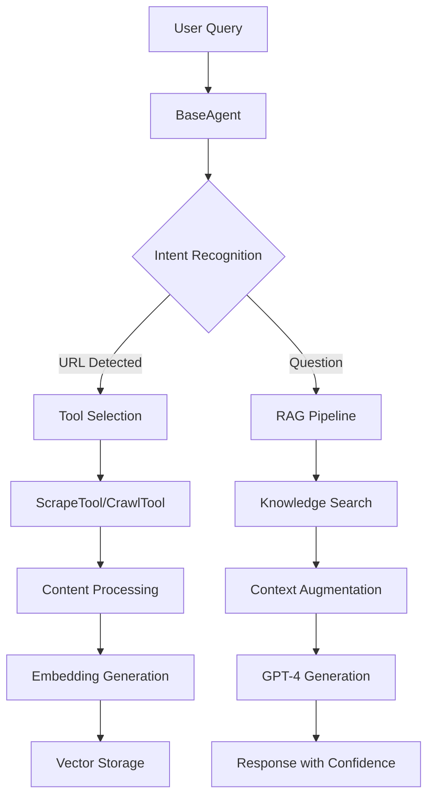

# AI RAG Agent

An intelligent knowledge assistant powered by BaseAgent orchestration that automatically ingests website content and provides instant, contextual answers with confidence scoring and source attribution.

## 🚀 Features

### Core Capabilities

- **🤖 BaseAgent Orchestration**: Sophisticated agent layer that coordinates tools and RAG pipeline
- **🌐 Smart Web Ingestion**: Dual-mode scraping (static HTML & JavaScript-rendered content)
- **🔍 Intelligent Crawling**: Multi-page crawling with depth control and robots.txt compliance
- **💡 Confidence Scoring**: Every response includes a confidence score (0.0-1.0)
- **📚 Source Attribution**: Expandable source citations with direct links
- **🗄️ Dual Storage Modes**: In-memory for development, PostgreSQL + pgvector for production
- **⚡ Real-time Progress**: Live updates during scraping and crawling operations
- **🎛️ Knowledge Management**: Interactive UI for viewing and managing knowledge base

### Technical Highlights

- Tool-based plugin architecture for extensibility
- Storage strategy pattern for environment-based switching
- Semantic chunking with overlap for context preservation
- 5-minute URL caching to prevent redundant scraping
- Automatic fallback from fast fetch to Playwright for JavaScript sites

## 🔒 Security Features

### SSRF (Server-Side Request Forgery) Protection

The application includes comprehensive URL validation to prevent SSRF attacks:

- **Private Network Blocking**: Blocks access to private IP ranges (10.0.0.0/8, 172.16.0.0/12, 192.168.0.0/16)
- **Localhost Protection**: Prevents access to localhost and loopback addresses (127.0.0.0/8, ::1)
- **Cloud Metadata Protection**: Blocks access to cloud instance metadata endpoints (169.254.169.254)
- **IPv6 Security**: Validates and blocks private IPv6 addresses (fe80::/10, fc00::/7, fd00::/8)
- **Port Restrictions**: Blocks access to internal service ports (SSH, databases, etc.)
- **DNS Rebinding Prevention**: Validates resolved IP addresses to prevent DNS-based attacks

All URL inputs through the ScrapeTool, CrawlTool, and direct scraping endpoints are validated using the secure URL validator before any network requests are made.

## 🏗️ Architecture Overview



### Component Overview

- **BaseAgent**: Orchestrates the entire pipeline, managing tool execution and RAG operations
- **Tool Registry**: Plugin system for ScrapeTool, CrawlTool, and future tools
- **Storage Strategy**: Abstraction layer supporting both in-memory and persistent storage
- **RAG Service**: Handles embeddings, vector search, and response generation

## 🚀 Getting Started

### Prerequisites

- **Node.js** 18.17 or later
- **pnpm** 8.0 or later
- **OpenAI API Key** with GPT-4 access

### Quick Start

1. **Clone and install:**

```bash
git clone https://github.com/yourusername/website-rag-agent.git
cd website-rag-agent
pnpm install
```

2. **Configure environment:**

```bash
cp .env.example .env.local
# Add your OpenAI API key to .env.local
```

3. **Start development server:**

```bash
pnpm dev
```

4. **Open browser:**
   Navigate to [http://localhost:3000](http://localhost:3000)

### First Steps

1. The knowledge base starts with 7 pre-loaded documentation chunks
2. Add a website by entering a URL and clicking the arrow button
3. Choose between single page scraping or multi-page crawling
4. Ask questions about the ingested content
5. View confidence scores and expandable source citations

## 💻 Usage Examples

### Adding Content to Knowledge Base

**Single Page:**

```
URL: https://docs.example.com/getting-started
Mode: Scrape single page
→ Fetches page, chunks content, generates embeddings
```

**Multi-page Site:**

```
URL: https://docs.example.com
Mode: Crawl (depth: 2, max: 20 pages)
→ Discovers pages, respects robots.txt, processes batch
```

### Asking Questions

```
Query: "How do I configure authentication?"
→ Embeds query
→ Searches knowledge base
→ Returns answer with:
  - Confidence: 0.82
  - Sources: [docs-auth-1, docs-auth-2]
  - Mode: RAG (using knowledge base)
```

## 🛠️ Tech Stack

- **Framework**: Next.js 15 with Turbopack
- **Language**: TypeScript (strict mode)
- **AI**: Vercel AI SDK 5 + OpenAI GPT-4
- **Embeddings**: OpenAI text-embedding-3-small (1536 dimensions)
- **UI**: shadcn/ui components + Tailwind CSS v4
- **Web Scraping**: Playwright + native fetch API
- **Storage**:
  - Development: In-memory Map-based store
  - Production: Vercel Postgres with pgvector
- **Testing**: Vitest with comprehensive test suite (97 tests passing)
- **Code Quality**: ESLint, Prettier, Husky pre-commit hooks

## 📦 API Endpoints

### POST `/api/chat`

Main chat endpoint using BaseAgent orchestration.

**Request:**

```json
{
  "message": "Your question or URL here"
}
```

**Response:**

```json
{
  "response": "The answer to your question...",
  "confidence": 0.85,
  "sources": ["source-1", "source-2"],
  "mode": "agent"
}
```

### GET `/api/knowledge`

Retrieve knowledge base contents or search.

**Query Parameters:**

- `q` (optional): Search query

**Response:**

```json
{
  "sources": [...],
  "totalDocuments": 42
}
```

### DELETE `/api/knowledge`

Clear the knowledge base.

**Request:**

```json
{
  "clearAll": true
}
```

## 🚢 Deployment

### Vercel Deployment (Recommended)

1. **Push to GitHub:**

```bash
git push origin main
```

2. **Import to Vercel:**

- Go to [vercel.com](https://vercel.com)
- Import your repository
- Add environment variables:
  - `OPENAI_API_KEY`: Your OpenAI API key

3. **Optional: Enable Persistent Storage**

- In Vercel dashboard → Storage → Create Database → Postgres
- Database URL will be automatically configured
- Tables are created on first run

### Environment Variables

```env
# Required
OPENAI_API_KEY=sk-...your-key-here

# Optional (auto-configured by Vercel)
POSTGRES_URL=your-postgres-url
USE_PERSISTENT_STORAGE=true
```

## 📊 Test Coverage

- **BaseAgent Tests**: 31/31 passing ✅
- **Tool System Tests**: 21/21 passing ✅
- **Storage Tests**: 23/23 passing ✅
- **CrawlTool Tests**: 22/22 passing ✅
- **SemanticChunker Tests**: 20/24 passing (4 non-critical failures)
- **Total**: 97 tests passing

## ⚠️ Known Issues & Limitations

- **Document Deletion**: Individual document deletion not supported (use Clear All)
- **URL Caching**: 5-minute cache may cause stale content issues
- **Token Limits**: Large documents are chunked at 3000 characters
- **Confidence Threshold**: Set to 0.3 (relatively low for better recall)
- **ESLint Warnings**: ~115 warnings (mostly `any` types) but non-blocking

## 📋 Development Commands

```bash
pnpm dev          # Start development server
pnpm build        # Build for production
pnpm start        # Start production server
pnpm test         # Run test suite
pnpm lint         # Lint code with ESLint
pnpm lint:fix     # Auto-fix ESLint issues
pnpm format       # Format code with Prettier
pnpm format:check # Check formatting without changes
```

## 🧪 Testing

The project includes comprehensive tests for:

- BaseAgent orchestration (31 tests passing ✅)
- Tool execution (21 tests passing ✅)
- Storage strategies (23 tests passing ✅)
- Vector operations
- Semantic chunking

**Test Status**: All critical tests passing! (Some non-critical SemanticChunker tests pending fixes)

Run tests with:

```bash
pnpm test
```

## 📐 Code Standards

- **Functions**: Maximum 15 lines
- **Files**: Maximum 100 lines
- **TypeScript**: Strict mode enabled
- **Architecture**: Tool-based plugin system
- **Testing**: TDD approach

## 🔄 Development Workflow

The project maintains detailed documentation:

- `agents.md`: Primary behavioral contract and workflow guide
- `CLAUDE.md`: Technical reference and architecture details
- `todo.md`: Task tracking
- `decision-log.md`: Technical decisions
- `change-log.md`: Implementation history
- `scratchpad.md`: Planning notes (MUST use before coding)
- `slash-ideas.md`: Automation command templates for Claude Code

## 🤝 Contributing

1. Fork the repository
2. Create a feature branch
3. Follow TDD approach
4. Ensure tests pass
5. Submit pull request

## 📚 Documentation

- [API Documentation](./API.md) - Detailed endpoint specifications
- [Architecture Guide](./ARCHITECTURE.md) - Technical design details
- [Deployment Plan](./deployment-plan.md) - Production setup guide

## 📄 License

MIT

---

Built with Next.js, TypeScript, and the power of RAG technology.
