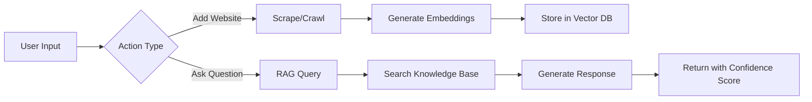
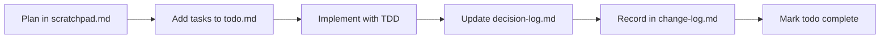

# Website RAG Agent

An intelligent knowledge assistant that automatically ingests website content and provides instant, contextual answers to user questions with confidence scoring.

## 🏗️ How It Works

This RAG (Retrieval-Augmented Generation) application ingests website content and provides intelligent, context-aware answers with confidence scoring.

### Core Workflow



### 1️⃣ Adding Content to Knowledge Base

When you add a website URL, the system:

1. **Determines Strategy** - Single page → ScrapeTool, Multiple pages → CrawlTool
2. **Fetches Content** - Tries fast fetch first, falls back to Playwright for JavaScript sites
3. **Processes Content** - Cleans HTML, extracts text, chunks if >3000 characters
4. **Generates Embeddings** - Creates 1536-dimensional vectors using OpenAI
5. **Stores Vectors** - Saves in VectorStore with metadata for retrieval

### 2️⃣ Answering Questions (RAG Process)

When you ask a question, the system:

1. **Embeds Query** - Converts your question to a vector
2. **Searches Knowledge** - Finds similar content using cosine similarity
3. **Calculates Confidence** - Scores relevance (0.0 to 1.0)
4. **Decides Mode**:
   - Confidence ≥ 0.5 → RAG mode (uses knowledge base)
   - Confidence < 0.5 → Direct mode (GPT-5 only)
5. **Generates Answer** - Augments prompt with context and calls GPT-5
6. **Returns Response** - Includes answer, confidence score, and sources

### 🔧 Technical Architecture

```
┌─────────────────┐     ┌──────────────────┐     ┌─────────────────┐
│   Frontend UI   │────▶│   API Routes     │────▶│   Tool Layer    │
│  (React/Next)   │     │  /api/chat       │     │  ScrapeTool     │
│                 │     │  /api/scrape     │     │  CrawlTool      │
└─────────────────┘     │  /api/crawl      │     └─────────────────┘
                        └──────────────────┘              │
                                 │                        ▼
                                 ▼                ┌─────────────────┐
                        ┌──────────────────┐     │   Web Content   │
                        │   RAG Service    │────▶│  Fetch/Browser  │
                        │  - Embeddings    │     └─────────────────┘
                        │  - Vector Search │
                        │  - GPT-5 Chat    │
                        └──────────────────┘
```

### 🎯 Key Features in Action

- **Smart Scraping**: Automatically switches between fetch (fast) and Playwright (JavaScript)
- **Respectful Crawling**: Honors robots.txt, implements rate limiting
- **Intelligent Chunking**: Splits large documents for optimal embedding
- **Confidence Scoring**: Shows how certain the AI is about its answer
- **Source Attribution**: Links every answer back to its source material
- **5-Minute Cache**: Avoids redundant scraping of same content

### 📊 Example Flow

**Adding a website:**
```
1. User enters: https://docs.example.com
2. System crawls 10 pages (respecting robots.txt)
3. Extracts ~50KB of documentation content
4. Chunks into 17 documents
5. Generates embeddings for each chunk
6. Stores in knowledge base
✅ "Successfully added 17 documents"
```

**Asking a question:**
```
1. User asks: "How do I configure authentication?"
2. System embeds query → [0.23, -0.45, 0.78, ...]
3. Searches knowledge base → finds 3 relevant chunks
4. Best match confidence: 0.82 (high relevance!)
5. Augments GPT-5 prompt with context
6. Returns detailed answer with:
   - Step-by-step configuration guide
   - Confidence score: 82%
   - Sources: [docs-auth-1, docs-auth-2]
   - Mode: RAG (using knowledge base)
```

## 🚀 Quick Start

1. Install dependencies:
   ```bash
   pnpm install
   ```

2. Create `.env.local` file:
   ```bash
   echo "OPENAI_API_KEY=your_openai_api_key_here" > .env.local
   ```

3. Start development:
   ```bash
   pnpm dev
   ```

Open [http://localhost:3000](http://localhost:3000) to interact with the RAG agent.

## 📋 Project Documentation

This project maintains comprehensive documentation for development workflow:

| File | Purpose |
|------|---------|
| `CLAUDE.md` | AI agent instructions and project guidelines |
| `prd.md` | Product requirements and phased development plan |
| `technical-spec.md` | Technical architecture and specifications |
| `quality-standards.md` | Code quality and testing requirements |
| `agents.md` | AI agent configuration and behavior |

## 🔄 Development Workflow

### Required Documentation Updates

Every development session MUST maintain these files:

1. **`scratchpad.md`** - Planning notes and design decisions
2. **`todo.md`** - Task tracking with status markers
3. **`decision-log.md`** - Technical choices and rationale
4. **`change-log.md`** - File modifications and refactoring

### Workflow Process



## 🏗️ Development Phases

### Completed ✅
- **MVP**: Basic Text-Only RAG with confidence scoring
- **Phase 0**: Tool Chest Foundation - Base Tool architecture
- **Phase 0.5**: Tool Migration - Converted scrapers/crawlers to Tools
- **Phase 1**: Web Scraping - Playwright integration
- **Phase 2**: Web Crawling - Multi-page with robots.txt compliance

### Current Features
- ✅ Chat interface with GPT-5
- ✅ In-memory vector storage with embeddings
- ✅ Web scraping (ScrapeTool with fetch/Playwright strategies)
- ✅ Web crawling (CrawlTool with depth control)
- ✅ RAG system with confidence scoring
- ✅ Tool-based architecture for extensibility

### Upcoming Phases
- **Phase 3**: Persistent Storage (pgvector)
- **Phase 4**: Advanced RAG Features
- **Phase 5**: Multi-modal Support

## 🎯 Success Metrics

- **Accuracy**: >95% correct responses (confidence ≥ 0.9)
- **Performance**: <200ms average response time
- **Coverage**: 100% test coverage required
- **Quality**: Max 15 lines per function, 100 lines per file

## 🛠️ Tech Stack

- **Framework**: Next.js 15 with Turbopack
- **Language**: TypeScript (strict mode)
- **AI**: Vercel AI SDK 5 + OpenAI GPT-5
- **UI**: shadcn/ui + AI Elements
- **Styling**: Tailwind CSS v4
- **Testing**: Vitest (TDD approach) - 60 tests passing
- **Web Scraping**: Playwright + fetch API
- **Architecture**: Tool-based with validation & retry logic
- **Package Manager**: pnpm (exclusively)

## 📝 Development Commands

```bash
pnpm dev        # Start development server
pnpm build      # Build for production
pnpm start      # Start production server
pnpm test       # Run test suite
pnpm lint       # Check code quality
pnpm format     # Format code
```

## 🔒 Quality Standards

- **Functions**: Max 15 lines
- **Files**: Max 100 lines
- **Testing**: TDD with 100% coverage
- **TypeScript**: Strict mode enabled
- **Commits**: Conventional format (`feat:`, `fix:`, etc.)

## 🌐 Resources

- [Vercel AI SDK RAG Example](https://github.com/vercel-labs/ai-sdk-preview-rag)
- [Playwright Docs](https://playwright.dev/docs/scraping)
- [Crawl4AI](https://crawl4ai.com/mkdocs/)
- [Vercel Postgres + pgvector](https://vercel.com/docs/storage/vercel-postgres)

## 📄 License

MIT